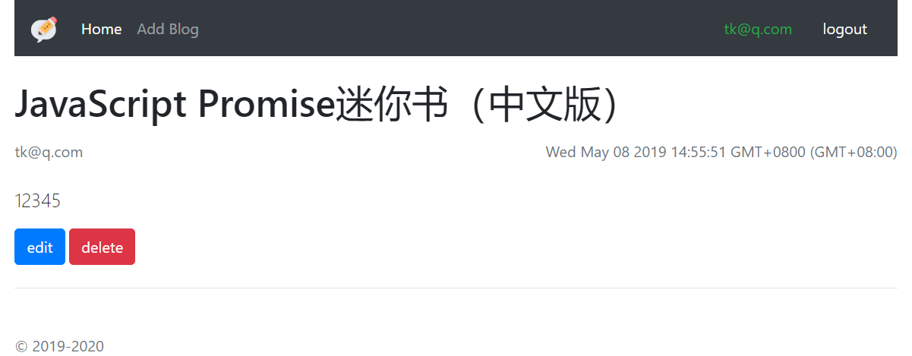

# myblog
blog node koa
## 启动：

1. 打开数据库服务

``` bash
mongod --dbpath db
```
2.开启web服务

```
npm start 
```
或者：
```
node index.js
```

3. 浏览器访问：http://localhost:3456

## 运行截图
1. 首页

1. 注册

1. 登录

1. 登录后首页

1. 写文章

1. 修改文章
